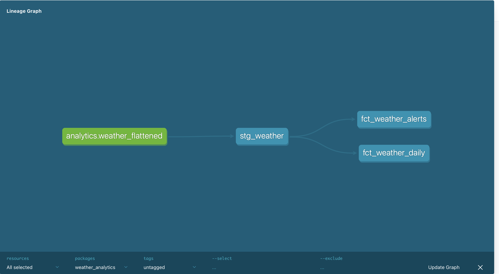
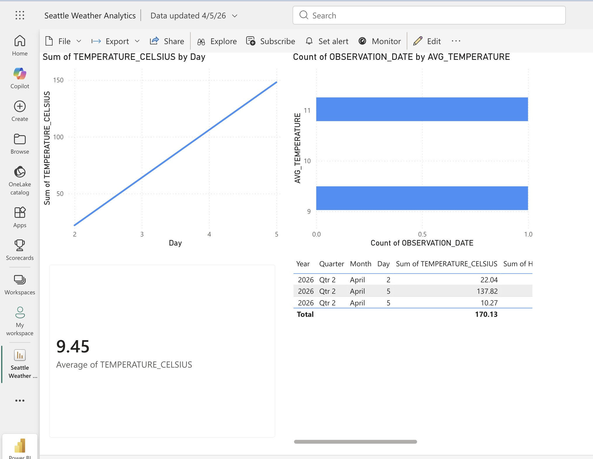

# weather-analytics-pipeline
End-to-end data engineering project: Weather API to Azure to Snowflake.

# Seattle Weather Analytics Pipeline (End-to-End)

## Overview
An automated ELT data pipeline that fetches real-time weather data for Seattle, lands it in **Azure Data Lake (ADLS)**, and processes it in **Snowflake** using a Medallion Architecture. The final dataset is served live to **Power BI** for near real-time visualization.

## Architecture
1. **Orchestration:** Airflow pulls JSON data from the Weather API hourly.
2. **Load:** Raw JSON is landed in an Azure Data Lake Gen2 container (`weather-raw-data`).
3. **Ingest (Bronze):** Snowflake External Stages load the JSON from Azure into a `VARIANT` column.
4. **Transform (Silver):** Snowflake Streams and Tasks handle Change Data Capture (CDC) to flatten the JSON into tabular staging models.
5. **Model (Gold):** dbt (Data Build Tool) handles final business logic, testing, and fact tables (`fct_weather_daily`).
6. **Visualize:** Power BI connects live to Snowflake for real-time weather insights.

---

## Technical Highlights

### 1. dbt Lineage and Medallion Architecture
The data is structured into a logical transformation flow using dbt. This lineage graph demonstrates the progression from raw staging models to finalized analytics fact tables.

### 2. Live Power BI Visualization
The final processed data is exposed via an analytics schema in Snowflake, allowing Power BI to provide insights into Seattle's temperature trends.

### 3. dbt Transformation Workflow
The project follows a modular dbt workflow to ensure data quality and reliability before the data hits the Power BI dashboard:

* **Staging:** Initial cleaning, renaming, and unit conversions (e.g., Fahrenheit to Celsius).
* **Marts:** Business-level aggregations and alerting logic for final consumption.
* **Testing:** Automated schema tests (`not_null`, `unique`) run on every build to prevent data gaps.
* **Documentation:** Auto-generated documentation and lineage tracking for full data transparency.
---

## How to Run This Project
1. **Environment Setup:** Copy `.env.example` to `.env` and populate your API keys and Snowflake credentials.
2. **Orchestration:** Start Airflow using `airflow standalone`. The DAG `weather_analytics_pipeline` will begin running on its hourly schedule.
3. **Database Setup:** Run the SQL scripts in the `/snowflake_setup` folder to create the databases, schemas, tables, and stages.
4. **Transformation:** Run `dbt build` inside the `dbt_weather` folder to create the analytics models and run data quality tests.